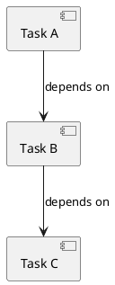

# Story #8: Implement PlantUmlParser

**GitHub URL:** https://github.com/elephantgerald/bartleby/issues/8
**State:** Closed
**Labels:** `story`, `phase-2`
**Milestone:** [Phase 2: PlantUML & Dependency Resolution](../milestone-1-plantuml-dependency.md)
**PR:** [#18](https://github.com/elephantgerald/bartleby/pull/18)

## Overview

Parse PlantUML component/object diagrams into a `DependencyGraph` model.

## Tasks

- [x] Define PlantUML grammar subset to support (components, dependencies, notes)
- [x] Implement `PlantUmlParser.cs` in `Bartleby.Infrastructure/Graph/`
- [x] Parse nodes (components/objects) from PlantUML
- [x] Parse dependency arrows (`-->`, `..>`, etc.)
- [x] Build `DependencyGraph` model from parsed data
- [x] Handle parse errors gracefully

## Testing Requirements

- [x] Unit tests for parsing valid PlantUML
- [x] Unit tests for handling malformed PlantUML
- [x] Unit tests for edge cases (empty files, comments, nested structures)
- [x] Integration test with real `.puml` files

## Acceptance Criteria

- [x] Parser extracts nodes and edges from PlantUML syntax
- [x] Parser returns meaningful errors for invalid input
- [x] All tests pass (59 tests)

## Implementation Notes

**Files created:**
- `src/Bartleby.Infrastructure/Graph/PlantUmlParser.cs` - Regex-based parser
- `src/Bartleby.Infrastructure/Graph/PlantUmlParseResult.cs` - Models for parse output
- `tests/Bartleby.Infrastructure.Tests/Graph/PlantUmlParserTests.cs` - 59 unit tests

**Supported PlantUML syntax:**
- Node types: `component`, `object`, `rectangle`, `node`, `package`
- Aliases: word chars, hyphens, dots (e.g., `task-1`, `my.component`)
- Titles: quoted strings with escaped quote support (`\"`)
- Arrows: `->`, `-->`, `..>`, `==>` with decorators (`o`, `*`, `#`, `x`, etc.)
- Comments: `' single line`
- Blocks: `@startuml` / `@enduml`

## Example PlantUML to Support

---
**Story**: Testable unit of code | **Parent Epic**: #2 PlantUML & Dependency Resolution

---
*Cached from GitHub: 2025-12-28*
