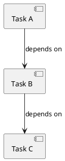

# Story #8: Implement PlantUmlParser

**GitHub URL:** https://github.com/elephantgerald/bartleby/issues/8
**State:** Open
**Labels:** `story`, `phase-2`
**Milestone:** [Phase 2: PlantUML & Dependency Resolution](../milestone-1-plantuml-dependency.md)

## Overview

Parse PlantUML component/object diagrams into a `DependencyGraph` model.

## Tasks

- [ ] Define PlantUML grammar subset to support (components, dependencies, notes)
- [ ] Implement `PlantUmlParser.cs` in `Bartleby.Infrastructure/Graph/`
- [ ] Parse nodes (components/objects) from PlantUML
- [ ] Parse dependency arrows (`-->`, `..>`, etc.)
- [ ] Build `DependencyGraph` model from parsed data
- [ ] Handle parse errors gracefully

## Testing Requirements

- [ ] Unit tests for parsing valid PlantUML
- [ ] Unit tests for handling malformed PlantUML
- [ ] Unit tests for edge cases (empty files, comments, nested structures)
- [ ] Integration test with real `.puml` files

## Acceptance Criteria

- [ ] Parser extracts nodes and edges from PlantUML syntax
- [ ] Parser returns meaningful errors for invalid input
- [ ] All tests pass

## Example PlantUML to Support

---
**Story**: Testable unit of code | **Parent Epic**: #2 PlantUML & Dependency Resolution

---
*Cached from GitHub: 2025-12-28*
